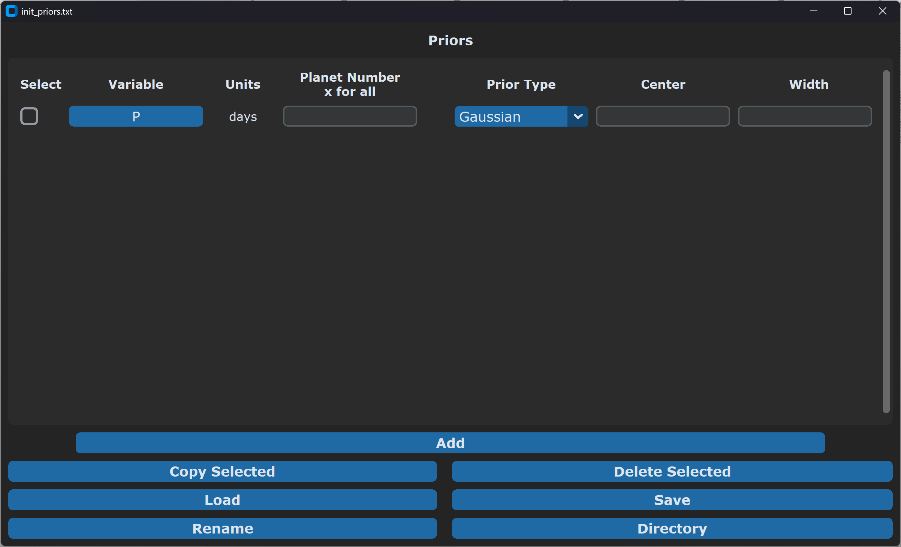
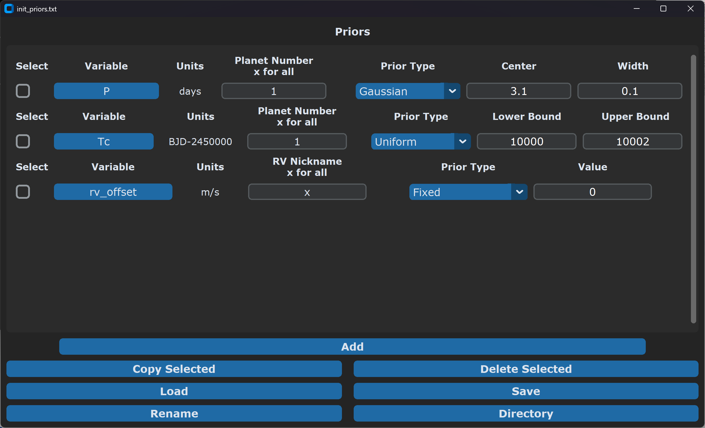

.. _priors_tut:

Priors
======

``Alfred`` gives you the option to set up priors for the fit parameters, and even some parameters that are not being directly fit. Priors allow you to set some restrictions on the fitting based on previous knowledge.

Currently, 5 types of priors are supported:

* Gaussian - A standard Gaussian distribution, defined by its mean and width. Useful for values with a previous independent measurement with uncertainties.
* Uniform - Essentially just setting a lower and upper bound for the variable.
* Log Uniform - For parameters that should be uniform across orders of magnitude, for instance period. For a variable x, the prior is proportional to 1/x.
* Modified Jeffrey's - Fixes the singularity at zero in a log uniform prior. Instead of a lower bound, there is a knee value. Below the knee value the prior is uniform, and above the knee value the prior is log uniform. Useful for something like RV semi-amplitude where you want to allow it to become zero.
* Fixed - Fixes a variable at a specific value rather than fitting for it.

The variables which currently are supported with priors are listed at the end of this page :ref:`here <prior_variables>`.

Setting Up Priors
-----------------

We can start by initializing an Init_priors object with a directory and a name (optional, default is "init_priors.txt"), then calling it to open the GUI.

.. code-block:: python

    alfred.Init_priors('/path/to/your/directory/', name = 'init_priors.txt')() #<--These parentheses at the end are needed to open the GUI

It will open an empty Init_priors GUI like the one in the image below:

Lets say we are fitting RV data for a transiting planet, and we prior information from the lightcurves that the period is :math:`3.1 \pm 0.1` days. We can set a Gaussian prior
for this by selecting the variable "P" (which happens to be selected by default upon opening the GUI), setting planet number to "1" (or whatever number corresponds to the planet
in the Init_planets file), selecting Gaussian prior from the dropdown, and setting the center and width to 3.1 and 0.1, respectively.

We also are pretty sure that Tc is at 10001 (in BJD-2450000), but we don't want to be as restrictive for some reason. We can instead bound Tc so that it can't loop across multiple periods.
First, click the "Add" button at the bottom to add a new prior. Select "Tc" from the variable dropdown menu, enter planet number "1" again, set the prior type to Uniform,
and enter a lower bound of 10000 and an upper bound of 10002.

Finally, lets say we have multiple RV datasets and we want to try the fit without fitting any offsets between the different data. We can fix all of the rv_offset variables at 0.
Click "Add" again to add a new prior. Then, select "rv_offset" as the variable and enter "x" to have this apply to all RV datasets rather than a specific one.
Select a Fixed prior type, and enter a value of 0.

After setting all of these priors up, the GUI should like the image below:

When you are all done, hit the "Save" button at the bottom to write out the file and close the GUI. You can edit this by using an Init_priors object with the same directory and name and calling it again, just like we did earlier.

If you want to know more about how the init files and GUIs work generally, see the tutorial :ref:`here <init_tut>`.

.. _prior_variables:

Variables
---------

* log(P) - natural log of the planet period in days
* P - planet period in days
* Tc - planet time of conjunction in BJD - 2450000
* ror - planet radius to stellar radius ratio
* log(a/rs) - natural log of planet semi-major axis to stellar radius ratio
* a/rs - planet semi-major axis to stellar radius ratio
* rhos - implied stellar density from planet transit in g/cm^3
* cos(i) - cosine of the planet orbital inclination
* i - planet orbital inclination in radians
* log(K) - natural log of the planet RV semi-amplitude in m/s
* K - planet RV semi-amplitude in m/s
* secw - square root of planet eccentricity times cosine of planet argument of periastron
* sesw - square root of planet eccentricity times sine of planet argument of periastron
* e - planet eccentricity
* w - planet argument of periastron in radians
* TT - individual planet transit time (for fitting TTVs) in BJD - 2450000
* fp - planet to star flux ratio
* F0 - lightcurve baseline flux value
* log(rho_gp) - natural log of the light curve gaussian process period in days
* rho_gp - light curve gaussian process period in days
* log(sigma_gp) - natural log of the light curve gaussian process standard deviation
* sigma_gp - light curve gaussian process standard deviation
* u1 - quadratic limb darkening linear term
* u2 - quadratic limb darkening non-linear term
* gamma - RV systemic velocity in m/s
* gamma_dot - 1st derivative of RV systemic velocity in m/s per day, relative to time of first RV point
* gamma_ddot - 2nd derivative of RV systemic velocity in m/s per day^2, relative to time of first RV point
* rv_offset - RV offset in m/s, for additional data sets beyond the first
* eep - equivalent evolutionary phase, used in fitting the star with isochrones
* log10(age) - log10 of stellar age in yr. This is used directly in fitting
* age - stellar age in yr.
* feh - stellar metallicity in dex
* distance - distance to the system in pc
* AV - V band extinction in mags
* mstar - stellar mass in solar masses
* rstar - stellar radius in solar radii
* rhostar - mean stellar density in g/cm^3 in stellar fitting